# 🍰 Site de Receitas

Este projeto é um **site web front-end** desenvolvido com **HTML, CSS, JavaScript e Bootstrap**, com o objetivo de apresentar **receitas reais organizadas por múltiplas categorias**, oferecendo uma experiência interativa, intuitiva e visualmente agradável.

O site conta com **categorias variadas**, **dicas de cozinha**, páginas institucionais, integração com **redes sociais reais**, além de funcionalidades como **login, logout, comentários e adição de novas receitas**.

---

## 🎯 Objetivo do Projeto

Este projeto foi desenvolvido com fins **educacionais**, para praticar:

- Estruturação semântica de páginas HTML
- Estilização de layouts responsivos com CSS e Bootstrap
- Interatividade e manipulação do DOM com JavaScript
- Organização de conteúdo por categorias
- Criação de formulários e fluxos de navegação
- Implementação de funcionalidades dinâmicas no front-end
- Boas práticas de organização de repositórios no GitHub

---

## 🌐 Visão Geral

O site permite ao usuário:

- Navegar por **múltiplas categorias de receitas**
- Visualizar **receitas detalhadas**, com ingredientes, modo de preparo e dicas de cozinha
- Adicionar **comentários** nas receitas
- Acessar páginas institucionais como **Sobre o Site**
- Seguir páginas lúdicas que redirecionam para **Instagram, Twitter e Facebook reais**
- Adicionar novas receitas através de um formulário
- Realizar **login e logout**
- Entrar em contato através de uma página dedicada

---

## 📄 Páginas e Funcionalidades

- **Página Inicial (`index.html`)**  
  Apresentação do site, categorias em destaque e navegação por rolagem.

- **Categorias de Receitas**  
  Receitas organizadas por diferentes tipos, como molhos, aperitivos, entre outros.

- **Tela de Receita Individual**  
  Exibição completa da receita, com ingredientes, modo de preparo, dicas de cozinha e **comentários**.

- **Sistema de Comentários**  
  Permite que usuários comentem nas receitas, promovendo interação.

- **Adicionar Receita**  
  Formulário para inclusão de novas receitas no site.

- **Sobre o Site**  
  Informações sobre o projeto, proposta e funcionamento da plataforma.

- **Contato**  
  Página para envio de mensagens ou sugestões.

- **Login e Logout**  
  Controle de acesso para funcionalidades específicas do site.

---

## 📸 Capturas de Tela do Projeto

Abaixo estão algumas telas do **Site de Receitas**, destacando suas principais funcionalidades:

### 🏠 Tela Inicial  
Visão geral da página inicial do site.

<table>
  <tr>
    <td>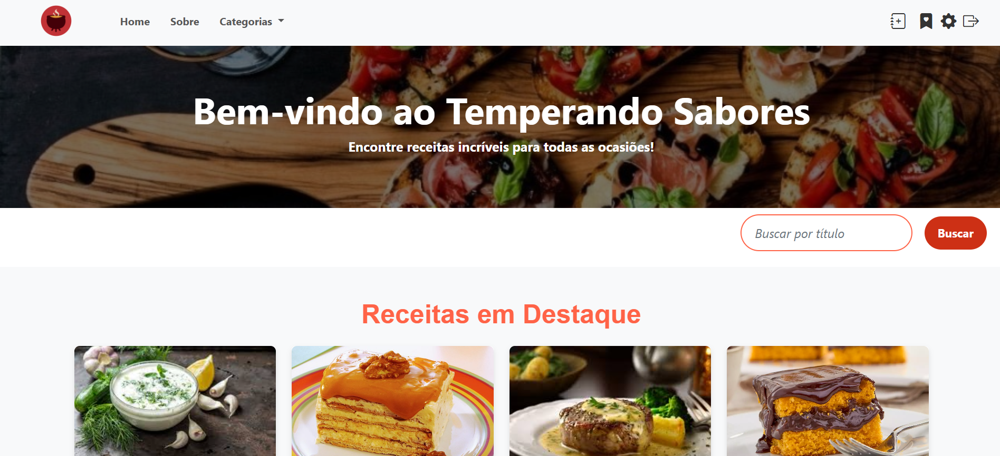</td>
    <td></td>
  </tr>
  <tr>
    <td></td>
    <td></td>
  </tr>
</table>


### ⬇️ Final da Página Inicial  
Rodapé e final da rolagem da página inicial.  

<table>
  <tr>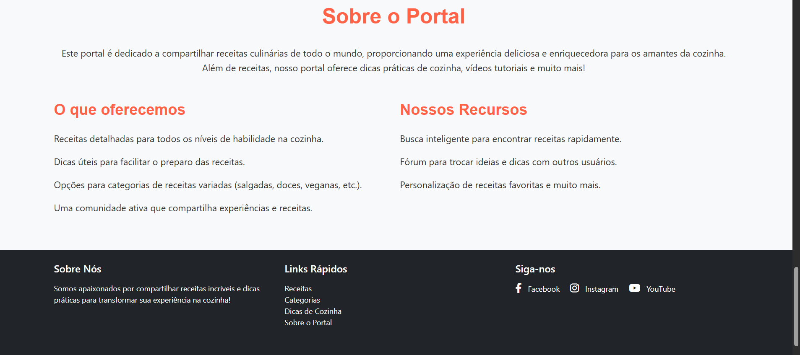</tr>
</table>


### 🍯 Exemplo de Receita — Categoria Molhos  
Visualização de uma receita real dentro da categoria de molhos, com detalhes e dicas de preparo.  

<table>
  <tr>
    <td>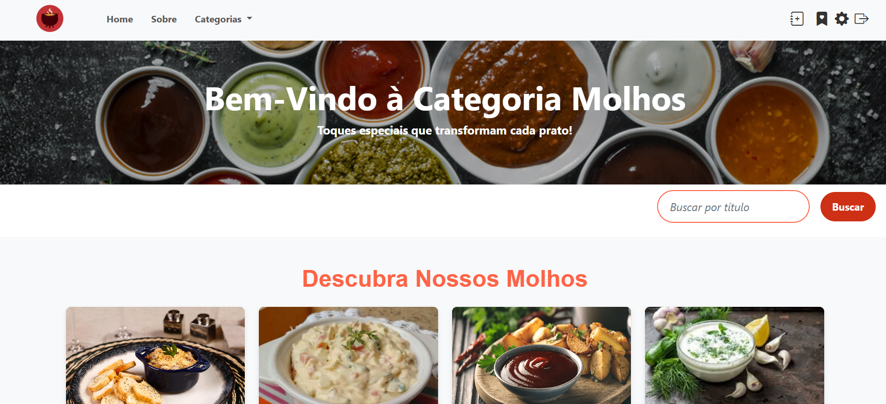</td>
    <td>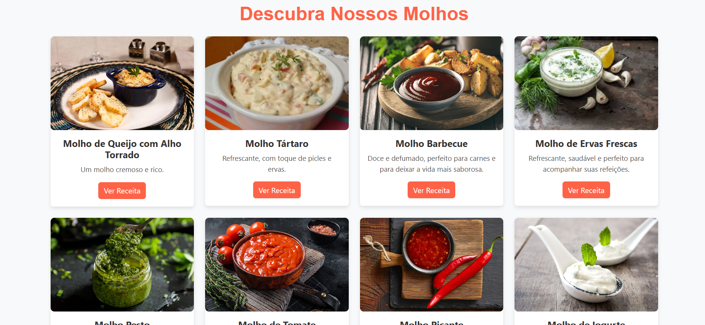</td>
  </tr>
  <tr>
    <td>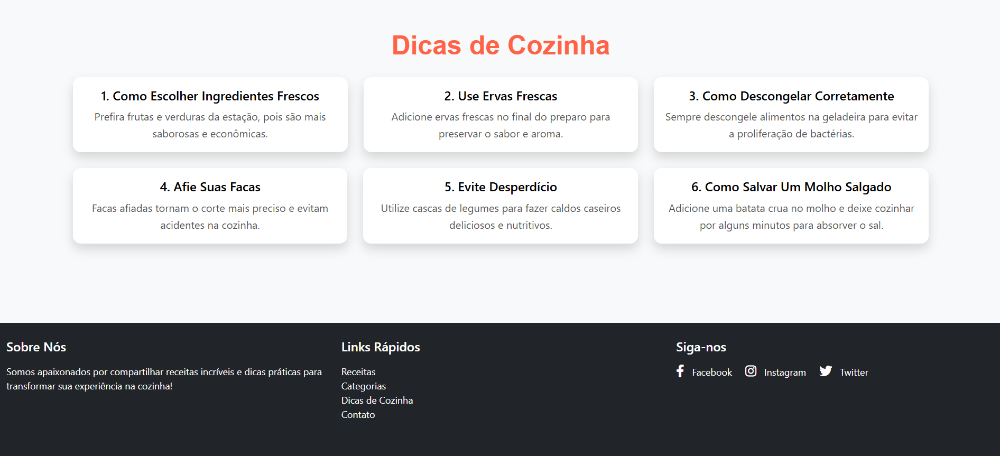</td>
  </tr>
</table>


### 🍽️ Tela de Receita Individual  
Página dedicada a uma receita específica, incluindo **comentários**.  

<table>
  <tr>
    <td>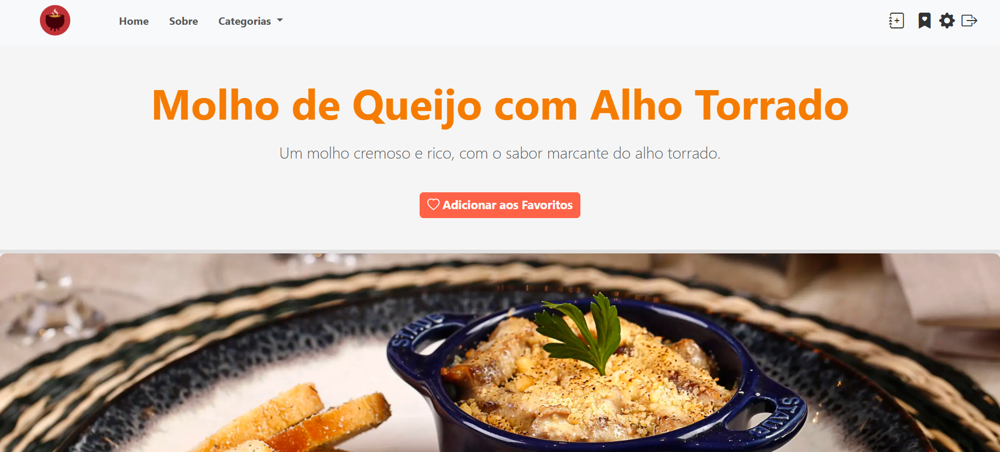</td>
    <td>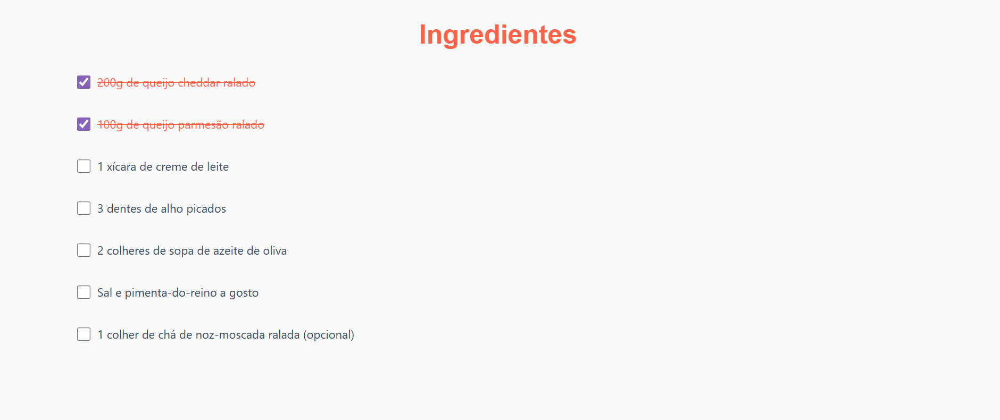</td>
  </tr>
  <tr>
    <td>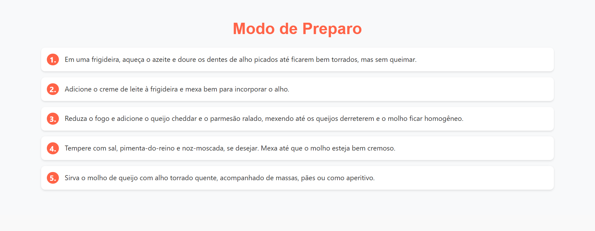</td>
    <td>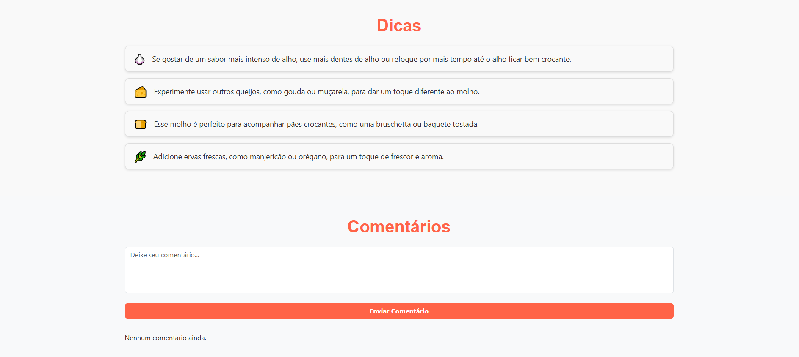</td>
  </tr>
</table>


### 🧺 Categorias — Aperitivos (Menu Aberto)  
Tela da categoria **Aperitivos** com o menu de categorias aberto.  

<table>
  <tr>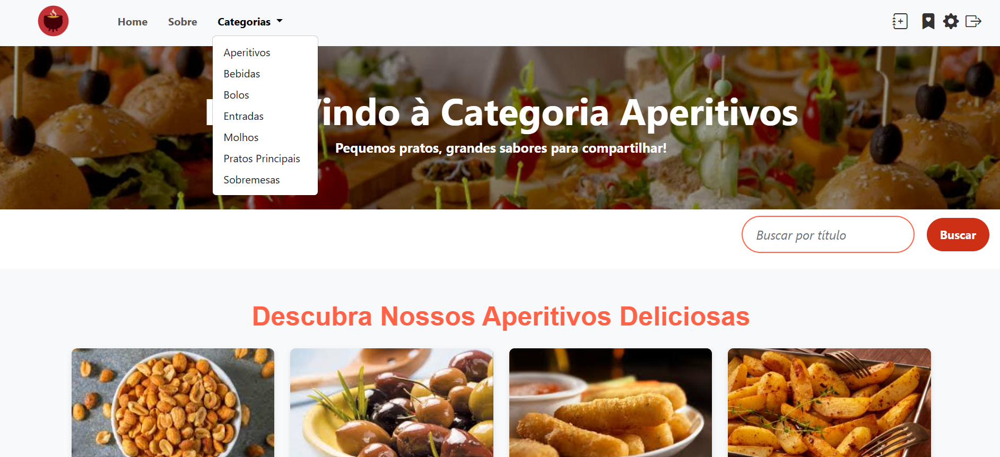</tr>
</table>


### 🔐 Tela de Registro e Login  
Autenticação e controle de acesso do usuário.  

<table>
  <tr>
    <td>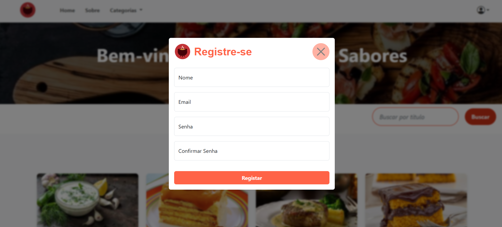</td>
    <td>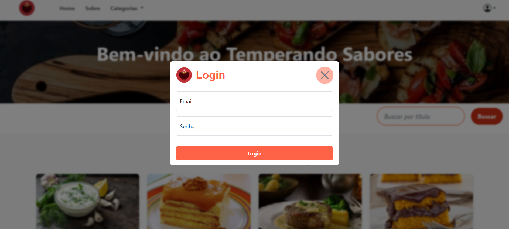</td>
  </tr>
</table>


### ➕ Tela de Adicionar Receita  
Formulário para cadastro de novas receitas.

<table>
  <tr>
    <td>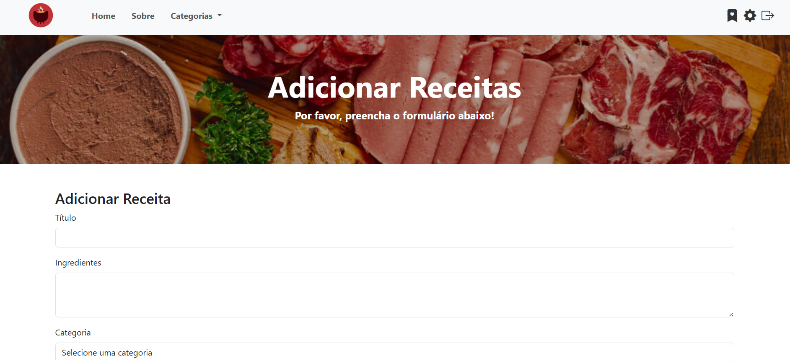</td>
    <td>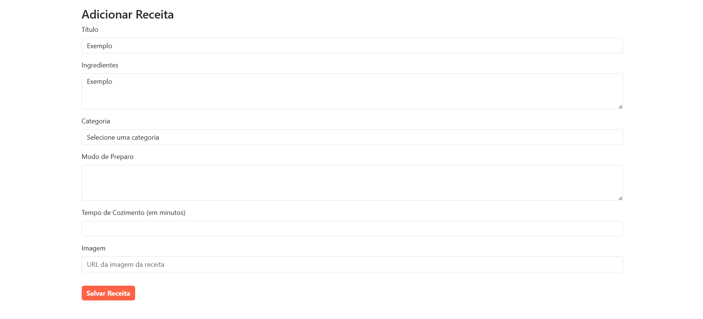</td>
  </tr>
  <tr>
    <td>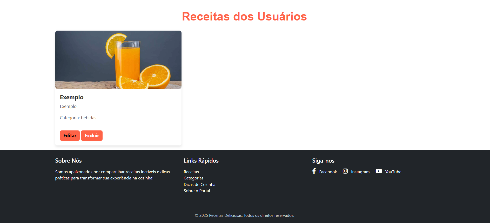</td>
  </tr>
</table>


### ✉️ Tela de Contato  
Página para envio de mensagens.  

<table>
  <tr>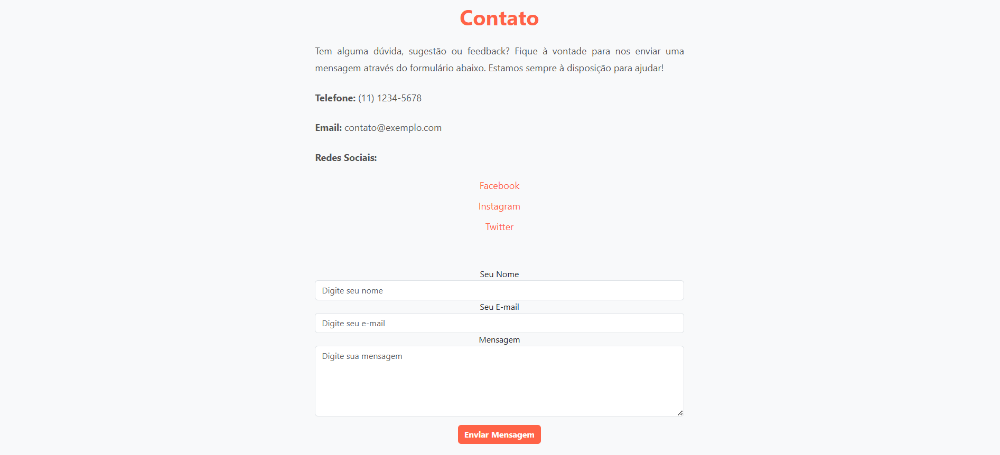</tr>
</table>


### ℹ️ Tela Sobre o Site  
Informações sobre o projeto e sua proposta.  

<table>
  <tr>
    <td>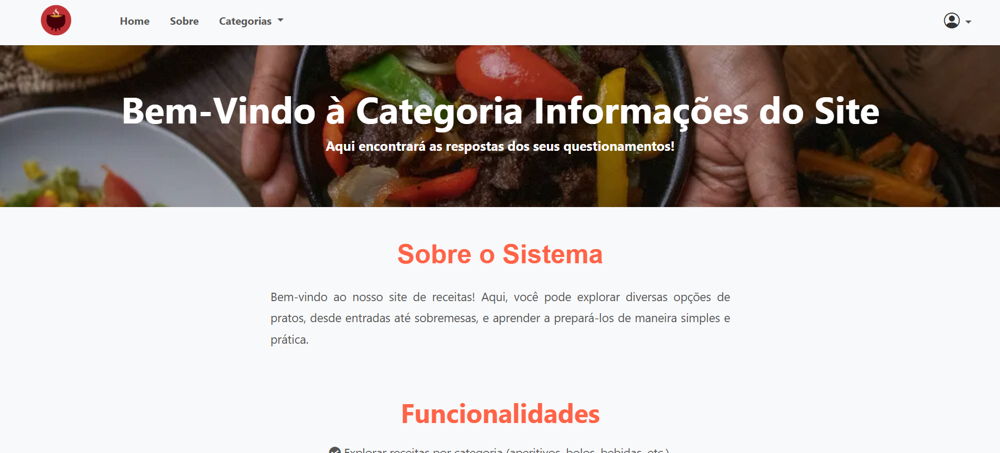</td>
    <td>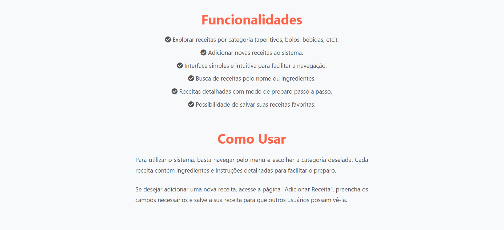</td>
  </tr>
</table>

---

## 🛠️ Tecnologias Utilizadas

- **HTML5** – Estrutura das páginas  
- **CSS3** – Estilização e layout  
- **JavaScript** – Interatividade, lógica e manipulação do DOM  
- **Bootstrap** – Componentes prontos e responsividade  
- **Flexbox & Grid** – Organização dos elementos  

> Projeto **front-end**, focado em organização, interatividade e experiência do usuário.

---

## ▶️ Como Executar o Projeto

1. Clone o repositório:

```bash
git clone https://github.com/jeniffer-leme/portal-receitas-culinarias.git
```

---

## 🚀 Melhorias Futuras

- Persistência de dados (ex: LocalStorage ou API)
- Sistema de avaliação das receitas
- Perfis de usuário
- Melhorias de acessibilidade
- Aprimoramento da experiência mobile

---

## 👩‍💻 Autora

**Jeniffer Leme**
